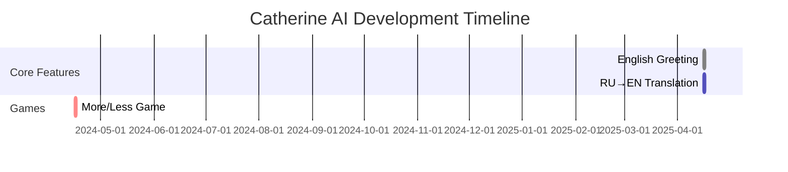

# Catherine AI Project Roadmap 🗺️

## Current Sprint: Localization & Games 🎯

### Task Board ✅➡️

```diff
! English Greeting Example
+ Status:       Completed ✅
- Branch:       `devel_v0`
# Commit:       `git commit -m "feat(greetings): Implement English hello example"`
@ Files:        `plugins/greeting_en.py`, `vacore.py`

! Translate Greeting from RU → EN 🔄
+ Status:       In Progress 🛠️ (80%)
- Branch:       `devel_v0`
# Commit:       `git commit -m "i18n: Add full English greeting translations"`
@ Files:        `locales/en.yaml`, `plugins/greeting_i18n.py`

! Support "More/Less" Game 🎮
+ Status:       Planned 📅 (Est. 3 days)
- Branch:       `feature/game-more-less`
# Commit:       `git commit -m "feat(game): Add More/Less number guessing game"`
@ Files:        `plugins/game_moreless.py`, `assets/game_sounds/`
```

## GitHub Commit Checklist 📋

1. **English Greeting**  
   ```bash
   git checkout devel_v0
   git add plugins/greeting_en.py vacore.py
   git commit -m "feat(greetings): Implement English hello response"
   git push origin devel_v0
   ```

2. **Translation Task**  
   ```bash
   git checkout -b i18n/english-translations
   git add locales/en.yaml plugins/greeting_i18n.py
   git commit -m "i18n: Add full English greeting dialogue"
   git push origin i18n/english-translations
   ```

3. **Game Implementation**  
   ```bash
   git checkout -b feature/game-more-less
   git add plugins/game_moreless.py assets/game_sounds/
   git commit -m "feat(game): Implement More/Less number guessing mechanic"
   git push origin feature/game-more-less
   ```

## Project Tracking 📊



## Legend 🧭
| Icon | Meaning                |
|------|------------------------|
| ✅   | Completed Task         |
| 🛠️   | In Development         |
| 📅   | Planned                |
| 🎮   | Game Feature           |
| 🔄   | Localization/Translation |
| 🗺️   | Roadmap                |

**Next Recommended Action:**  
```bash
git checkout i18n/english-translations
git commit --amend -m "i18n: Add full EN greeting with fallback handling"
```
